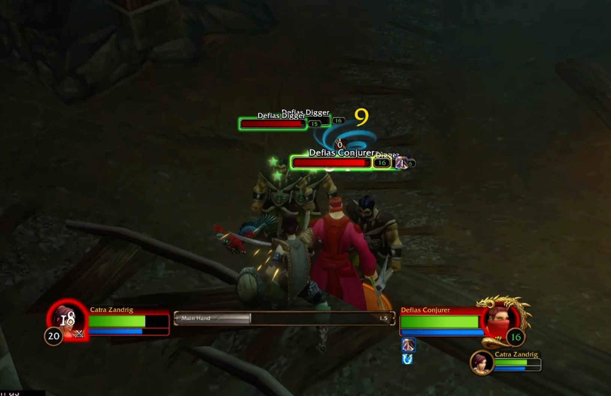
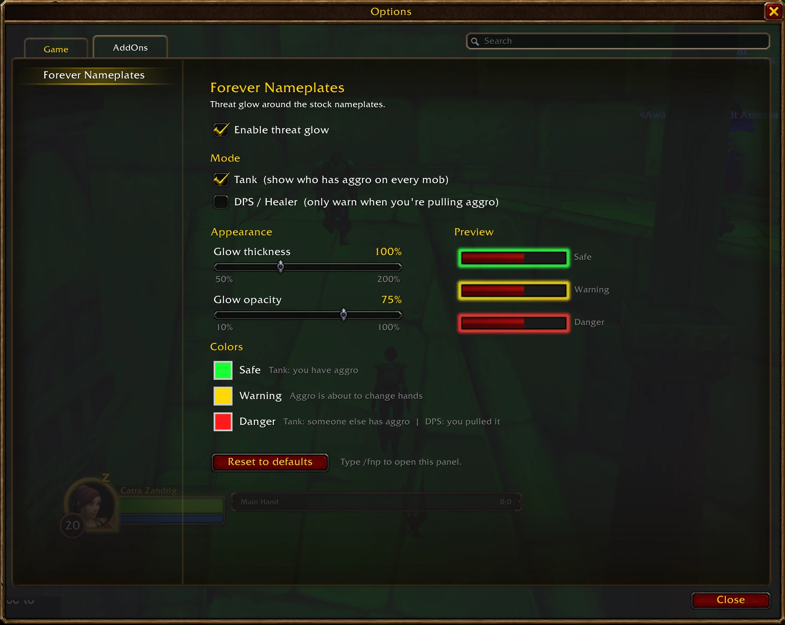

# Forever Nameplates

A simple, lightweight threat addon for **World of Warcraft Forever**. It keeps the stock Blizzard nameplates exactly as they are and adds a soft, threat-colored glow around the health bar, so you can see who has aggro at a glance.

## What the colors mean

| Glow | Tank mode (default) | DPS / Healer mode |
|---|---|---|
| 🟢 **Safe** | You have solid aggro | — |
| 🟡 **Warning** | You're about to lose aggro, or you're about to take it back | You're close to pulling aggro |
| 🔴 **Danger** | Someone else has aggro (including a mob already hitting a groupmate) | You've pulled aggro |
| No glow | Out of combat, friendly or dead | Everything else |

## Options

Type `/fnp` or go to **Esc → Options → AddOns → Forever Nameplates** to open the options panel.

- Turn the glow on or off
- Switch between Tank and DPS / Healer mode
- Adjust the glow thickness and opacity
- Pick your own color for each threat state
- See a live preview of your changes without pulling a mob

### Slash commands

| Command | Description |
|---|---|
| `/fnp` | Open the options panel |
| `/fnp tank` / `/fnp dps` | Switch mode |
| `/fnp toggle` | Turn the glow on or off |
| `/fnp size <0.5-2>` | Set the glow thickness |
| `/fnp alpha <0.1-1>` | Set the glow opacity |
| `/fnp reset` | Reset all settings to their defaults |
| `/fnp help` | List these commands |

## Installation

1. Download `ForeverNameplates-1.0.zip` from the [latest release](https://github.com/InuvrseStudio/ForeverNameplates/releases/latest).
2. Unzip it and copy the `ForeverNameplates` folder into your AddOns folder:
   - **Windows:** `World of Warcraft\_classic_beta_\Interface\AddOns\`
   - **macOS:** `/Applications/World of Warcraft/_classic_beta_/Interface/AddOns/`
3. Restart the game (a `/reload` won't pick up a newly installed addon).

If the addon shows as *out of date* on the character select screen, tick **Load out of date AddOns**.

## Compatibility

- Built for the World of Warcraft Forever beta (client 1.60.1, interface `16001`).
- Works with the default Blizzard nameplates. Nameplate replacement addons such as Plater or ElvUI nameplates are not supported.

## License

Released under the [MIT License](LICENSE).
