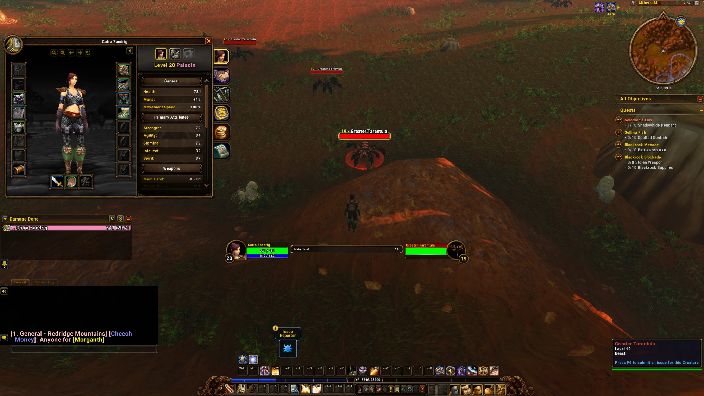
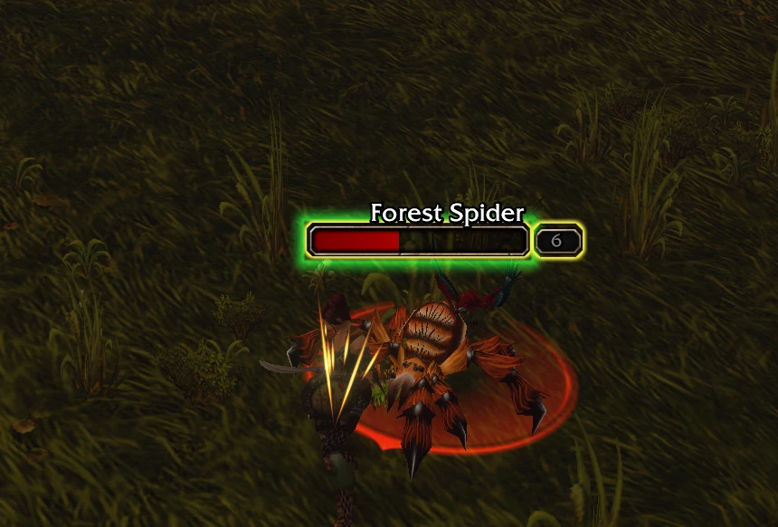
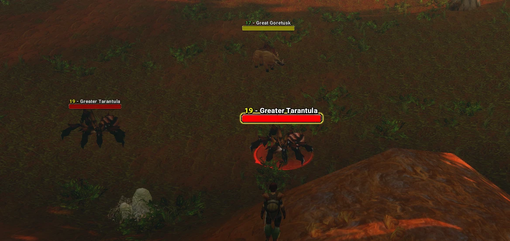
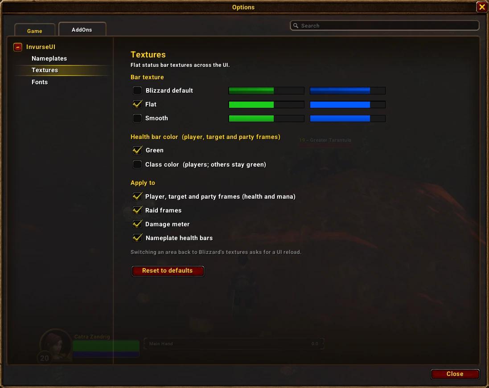
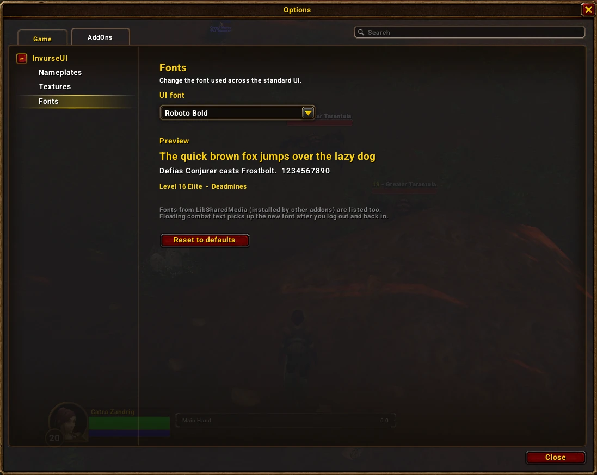
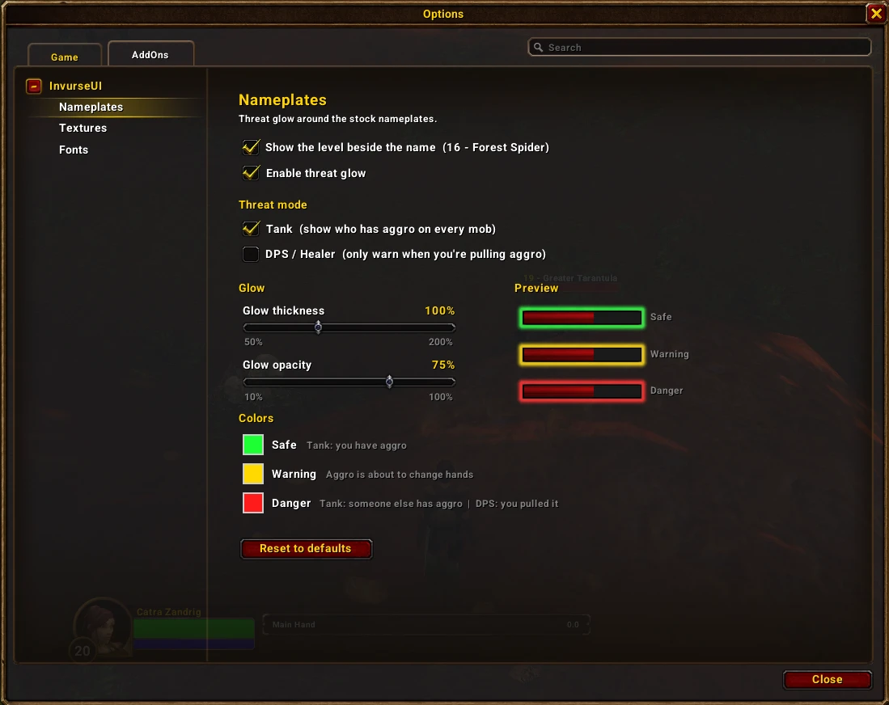

# InvurseUI

A lightweight addon for **World of Warcraft Forever** that makes subtle changes to the stock Blizzard UI. It grew out of *Forever Nameplates* and keeps that addon's threat glow, then adds a few small touches elsewhere:

- **Nameplates:** a threat-colored glow around the health bar, and the mob's level shown next to its name (`16 - Forest Spider`) instead of in a box on the right.
- **Textures:** flat bar textures for the player, target and party frames, the raid frames, the damage meter and, optionally, the nameplates.
- **Fonts:** change the font used across the standard UI.

## Nameplates

### Threat glow

| Glow | Tank mode (default) | DPS / Healer mode |
|---|---|---|
| 🟢 **Safe** | You have solid aggro | — |
| 🟡 **Warning** | You're about to lose aggro, or you're about to take it back | You're close to pulling aggro |
| 🔴 **Danger** | Someone else has aggro (including a mob already hitting a groupmate) | You've pulled aggro |
| No glow | Out of combat, friendly or dead | Everything else |

### Level beside the name

The level box on the right of the bar is removed and the level is shown in front of the name instead, colored by difficulty. Elites get a `+` (`16+ - Defias Overseer`), and mobs too high to tell show `??`. The health bar uses the freed-up space.

## Textures

Choose **Flat** (solid color), **Smooth** (flat with a very light shade) or **Blizzard default**, and pick where it applies:

- Player, target and party frames (health and mana)
- Raid frames
- Damage meter
- Nameplate health bars (off by default)

With a flat texture, player, target and party health bars are classic green, or class colored for players if you prefer.

Switching an area back to Blizzard's textures asks you to reload the UI.

## Fonts

Pick a font for the standard UI. The built-in game fonts are always listed, along with the bundled **Roboto** family (Regular, Medium, Bold, Condensed and Condensed Bold, under the SIL Open Font License) and any fonts other addons register with LibSharedMedia. Floating combat text picks up the new font after you log out and back in.

## Options

Type `/iui` or go to **Esc → Options → AddOns → InvurseUI**. Each section (Nameplates, Textures, Fonts) has its own page.

### Slash commands

| Command | Description |
|---|---|
| `/iui` | Open the options panel |
| `/iui tank` / `/iui dps` | Switch threat mode |
| `/iui toggle` | Turn the threat glow on or off |
| `/iui size <0.5-2>` | Set the glow thickness |
| `/iui alpha <0.1-1>` | Set the glow opacity |
| `/iui reset` | Reset all settings to their defaults |
| `/iui help` | List these commands |

`/fnp` still works as an alias.

## Installation

1. Download the latest release zip from the [releases page](https://github.com/InuvrseStudio/ForeverNameplates/releases/latest).
2. Unzip it and copy the `InvurseUI` folder into your AddOns folder:
   - **Windows:** `World of Warcraft\_classic_beta_\Interface\AddOns\`
   - **macOS:** `/Applications/World of Warcraft/_classic_beta_/Interface/AddOns/`
3. If you had Forever Nameplates installed, delete its `ForeverNameplates` folder. Settings don't carry over.
4. Restart the game (a `/reload` won't pick up a newly installed addon).

If the addon shows as *out of date* on the character select screen, tick **Load out of date AddOns**.

## Compatibility

- Built for the World of Warcraft Forever beta (client 1.60.1, interface `16001`).
- Works with the default Blizzard UI. Nameplate or unit frame replacements such as Plater or ElvUI are not supported.

## License

Released under the [MIT License](LICENSE).
